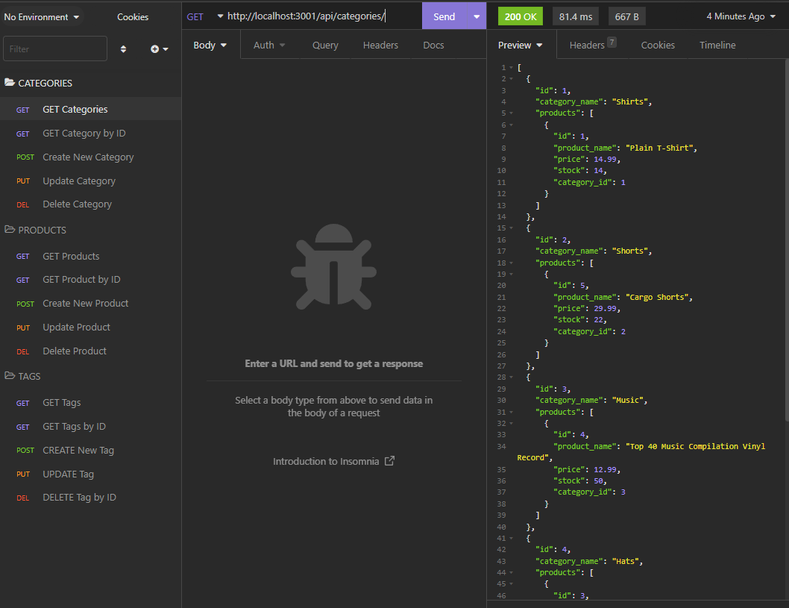

# E-Commerce-SQL

  
  
## Description
This is the 13th challenge for my Coding bootcamp journey. For this challenge, we had to follow acceptance criteria to create a command-line application (using NodeJS, MySQL, and Express) that is capable of executing CRUD functions to interact with a database that was seeded. This application uses the ``MySQL2`` and ``Sequelize`` packages to connect to the MySQL database. ``Dotenv`` was used for environment variables to store sensitive data.
  
## Table of Contents
* [Description](#description)
* [Usage](#usage)
* [Questions](#questions)
  
## Usage

Below shows an example of JSON data being displayed given the type of api request

  
## Questions
Any Questions? Please reachout to me at Noahbrown2663@gmail.com
In addition, you can view this project and others on my [GitHub](https://github.com/Noahbrown26)
